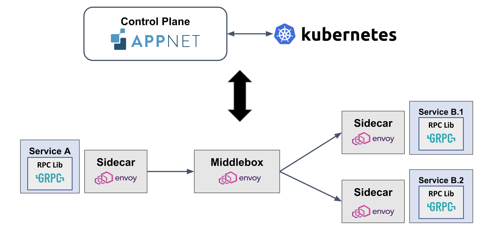

# AppNet: Expressive, Easy-to-build, and High-performance Application Networks

<iframe src="https://ghbtns.com/github-btn.html?user=appnet-org&repo=appnet&type=star&count=true&size=large" frameborder="0" scrolling="0" width="170" height="30" title="GitHub"></iframe>

## What is AppNet?

AppNet is a framework designed for constructing high-performance application networks for microservices. At its core, AppNet offers a high-level abstraction that facilitates the creation of expressive and performant application networks. Users can define rich, possibly stateful, layer-7 (RPC) processing through match-action rules. AppNet's compiler compiles these specifications and generates high-performance code by optimizing where and how to execute different RPC processing functions.

Details are available in our [arxiv paper]() and [talk](). (To be added)

## Architecture Overview

AppNet consists of three main components - the AppNet program, the control plane and the data plane. TThe AppNet program orchestrates the network functionality among microservices through a sequence of elements, detailing each element with match-action rules that govern RPC content and element state.

The control plane includes a compiler that processes RPC definitions and chain specifications to produce code modules and a controller has global knowledge (acquired via cluster managers such as Kubernetes) of the network topology, service locations, and available AppNet data plane processors. It provisions network processing on available processors.

The data plane is composed of processors—such as sidecars, middleboxes, and RPC libraries—that execute the elemental operations at a low level. Each processor retrieves the compiled RPC processing logic from the control plane and periodically transmits logs, traces, and runtime statistical data back to the controller.

## Supported Data Plane Processors

- [mRPC](https://github.com/phoenix-dataplane/phoenix)
- [Istio](https://istio.io/)(Envoy)
    - Sidecar Mode
    - Ambient Mode
- [gRPC](https://grpc.io/) (via Interceptors) (in progress)

## Getting help

Please get in touch with Xiangfeng Zhu (xfzhu@cs.washington.edu).

